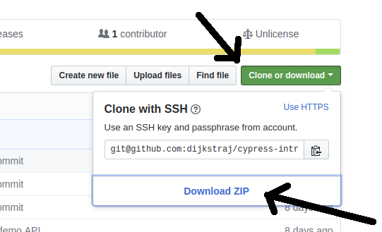
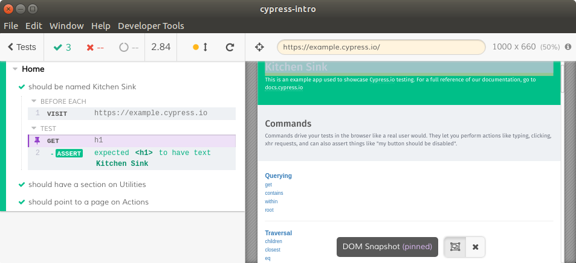

# Cypress

## Inleiding

In deze workshop gaan we de basisfunctionaliteit van Cypress ontdekken.
We beginnen met de installatie van Cypress.
Vervolgens gaan we onze eerste stappen zetten met het testen van de backend die we in de vorige workshop hebben gebouwd.
Daarna gaan we aan de slag met het testen van een frontend.
Omdat het zelf bouwen van een frontend buiten het bereik van deze cursus ligt gebruiken we de testpagina van Cypress zelf.
Tot slot noemen we een aantal onderwerpen om zelf mee aan de slag te kunnen gaan.

Alle tekst die op deze manier is uitgelijnd bevat opdrachten om uit te voeren.

> Ingesprongen blokken tekst bevatten extra informatie.

Commando's die je op de commandline moet uitvoeren zien er zo uit:

```bash
> npm run start
```

Bestandsnamen zijn cursief en de inhoud van bijvoorbeeld _test.js_ wordt zo weergegeven:

```javascript
function test() {
  return 'dit is een test';
}
```

Bij de meeste opdrachten staat een link naar
[voorbeeldcode](https://github.com/dijkstraj/cypress-intro/) op GitHub,
probeer echter eerst zelf de opdracht te maken voordat je daar gaat spieken.

## Voorbereiding

### Installeren

Download het [voorbeeldproject](https://github.com/dijkstraj/cypress-intro/tree/base)
en pak de ZIP uit op je lokale schijf.



Installeer de afhankelijkheden die in _package.json_ staan:

```bash
> cd cypress-intro-base\
> npm install
```

Voeg Cypress toe aan het project:

```bash
> npm install --save-dev cypress
```

### Draaien

Open _package.json_, hierin zie je dat er nog geen test-script is: `"test": "echo \"Error: no test specified\" && exit 1"`.
Pas het test-script aan naar `cypress open` om aan te geven dat we Cypress willen gebruiken voor het testen
([_package.json_](https://github.com/dijkstraj/cypress-intro/blob/master/package.json#L8)).
Start vervolgens Cypress vanaf de commandline met:

```bash
> npm run test
```

Cypress laat weten dat het een aantal mappen heeft aangemaakt.
Bekijk de inhoud van de map "cypress", hieronder zie je vier submappen:

* **fixtures**: voorbeelddata in JSON-formaat voor hergebruik
* **integration**: testscenario's
* **plugins**: haakje in Cypress om plugins te registreren
* **support**: extra commando's voor in je testscripts

Onder "integration" is een map met voorbeelden aangemaakt.
Deze voorbeeldscenario's draaien tegen een demo site van Cypress: [https://example.cypress.io](https://example.cypress.io).



Start een testscenario door erop te klikken.
Er opent nu een browser met aan de linkerkant een overzicht van teststappen
en aan de rechterkant de website die getest wordt.
Na het draaien van de test kun je op de teststappen klikken om
te zien hoe de browser er op dat moment uitzag.

## Backend

### Eerste test

We gaan nu onze eigen tests schrijven.
Maak in de map cypress/integration een bestand [_autos.spec.js_](https://github.com/dijkstraj/cypress-intro/blob/step1/cypress/integration/autos.spec.js) aan:

```javascript
describe('Autos', () => {
  it('should return an empty list', () => {
    // Vraag de lijst van auto's op
    cy.request('http://localhost:3000/autos')
      // Pak de lengte van de body
      .its('body.length')
      // Deze lengte moet gelijk zijn aan nul
      .should('eq', 0);
  });
});
```

Open Cypress (met `npm run test`) en klik op _autos.spec.js_.
De test faalt omdat de lokale server niet gestart is.

Start in een nieuw commandline-scherm de backend met `npm run start` en herstart de test.
Succes!

> In dit voorbeeld is de algemene structuur van een test te zien.
> Een `describe()` omschrijft een stuk functionaliteit van de applicatie,
> dit kan ook gebruikt worden om deelgebieden te beschrijven:
>
> ```javascript
> describe('Website X', () => {
>   describe('Navigatie', () => {
>     // test de correcte werking van de navigatie
>   });
>   describe('Zoeken', () => {
>     // test de correcte werking van de zoekbalk
>   });
>   describe('Vertalingen', () => {
>     // test de correcte werking van de taalkiezer
>   });
> })
> ```
>
> De eerste parameter van `describe()` is de naam die in de testrunner getoond wordt.
> Binnen de `describe()` specificieer je met `it()` de losse testscenario's.
> De naam "it" is gekozen omdat je dan Engelse volzinnen kunt maken voor elk scenario:
>
> ```javascript
> describe('Zoeken', () => {
>   it('should search when I press enter', () => {
>     // ...
>   });
>   it('should not perform a search when the input is too short', () => {
>     // ...
>   });
> })
> ```
>
> Deze structuur is een algemeen gebruikte standaard voor JavaScript testen.
> Alle Cypress-specifieke functionaliteit is beschikbaar in het `cy` object.
> De functies in dit object worden _commands_ genoemd en zijn in
> [de documentatie](https://docs.cypress.io/api) dan ook terug te vinden onder
> de kop "Commands".
>
> Voor het verifieren van data gebruik je
> [_assertions_](https://docs.cypress.io/guides/references/assertions.html).
> Cypress heeft hiervoor de [Chai](http://chaijs.com/) bibiliotheek.

### Test inhoud

Laten we nu het toevoegen van auto's testen in
[_autos.spec.js_](https://github.com/dijkstraj/cypress-intro/blob/step2/cypress/integration/autos.spec.js):

<!--- step 2 --->
```javascript
it('should add an auto', () => {
  cy.request('POST', 'http://localhost:3000/autos', {merk: 'Cypress'})
    .its('body')
    .should('eq', 'Cypress toegevoegd met id 1');
});
```

> We geven de body van de `POST` mee als gewoon JavaScript object,
> dus waar we in JSON `{"merk": "Cypress"}` moeten gebruiken mogen we
> dat hier iets makkelijker opschrijven als `{merk: 'Cypress'}`.

Je ziet nu twee groene vinkjes,
want elke keer dat je een test aanpast voert Cypress deze automatisch opnieuw uit :)

### Herhaalbare testen

Herstart nu handmatig de tests, je krijg nu een foutmelding te zien.
De test verwacht namelijk met een schone lei te beginnen.
We gaan ervoor zorgen dat dat waar is door voor élk testscenario de lijst met auto's leeg te gooien.

Maak in de backend een nieuwe route die de `DELETE` van `/autos` afhandelt.
Koppel deze route aan een nieuwe controllerfunctie `deleteAllAutos` met de volgende inhoud:

```javascript
const ids = Object.keys(autos);
ids.forEach(id => delete autos[id]);
response.send(ids.length + " auto's verwijderd");
```

> Je kunt in Postman kijken of het werkt door een aantal auto's toe te voegen,
> `DELETE /autos` uit te voeren en vervolgens `GET /autos`.

In plaats van de nieuwe functie handmatig te testen kunnen we hem meteen in de Cypress test hangen:

```javascript
beforeEach(() => {
  cy.request('DELETE', 'http://localhost:3000/autos');
});
```

Ons eerste scenario gaat nu op groen,
want we krijgen nu altijd een lege lijst terug.
Het tweede scenario gaat echter fout wanneer we de tests opnieuw draaien
(met het refresh-knopje in de testrunner).

Bedenk zelf hoe je kunt zorgen dat deze test altijd goed gaat.
Je kunt de test aanpassen,
maar dan is de test niet meer _idempotent_.
Het is beter om iets te veranderen in `deleteAllAutos()`.

<!--- step 3 --->
> Mocht je er niet uit komen, zie [_autos.controller.js_](https://github.com/dijkstraj/cypress-intro/blob/step3/autos.controller.js#L22)

### DRY URL's

We herhalen nu voor elke test de hele URL,
dat is in strijd met het [DRY-principe](https://en.wikipedia.org/wiki/Don%27t_repeat_yourself).
Wanneer de URL van de site wijzigt of we de tests tegen een andere omgeving willen draaien
zouden we alle testbestanden door moeten om dit aan te passen.

In Cypress kun je hiervoor een _baseURL_ configureren.
Bij de eerste keer starten is een leeg configuratiebestand gemaakt:
[_cypress.json_](https://github.com/dijkstraj/cypress-intro/blob/step4/cypress.json).
Zet nu dit in het bestand:

<!--- step 4 --->
```json
{
  "baseUrl": "http://localhost:3000"
}
```

In [_autos.spec.js_](https://github.com/dijkstraj/cypress-intro/blob/step4/cypress/integration/autos.spec.js)
kun je nu overal `http://localhost:3000` verwijderen,
dus `http://localhost:3000/autos` wordt `/autos`.

### Foutmeldingen testen

```javascript
it('should require field merk', () => {
  cy.request('POST', '/autos', {bouwjaar: 2010}).should(response => {
    // We verwachten een "Server Error" response
    expect(response.status).to.eq(500);
    expect(response.body).to.contain('Auto moet minstens een merk bevatten');
  });
});
```

Ondanks dat we in de `should()` de status 500 verwachten gaat de test fout
met de melding dat er een status 500 terugkwam.

> Zie [Wikipedia](https://en.wikipedia.org/wiki/List_of_HTTP_status_codes)
> voor een complete lijst van statuscodes.
>
> Het belangrijkste om nu te onthouden:
>
> * 200-299: OK
> * 400-499: Fout aan de kant van de client
> * 500-599: Fout aan de kant van de server


Cypress verwacht standaard dat elk request dat je expliciet uitvoert goed moet gaan,
omdat dit meestal gebruikt wordt voor het bootstrappen.
We krijgen in de foutmelding de hint om de optie `failOnStatusCode` te gebruiken,
hiervoor moeten we het request een beetje herschrijven ([_autos.spec.js_](https://github.com/dijkstraj/cypress-intro/blob/step5/cypress/integration/autos.spec.js)):

<!--- step 5 --->
```javascript
it('should require field merk', () => {
  cy.request({
    method: 'POST',
    url: '/autos',
    body: {bouwjaar: 2010},
    failOnStatusCode: false
  }).should(response => {
    expect(response.status).to.eq(500);
    expect(response.body).to.contain('Auto moet minstens een merk bevatten');
  });
});
```

## Frontend

### Eerste test

> Het checken van API-requests wordt nu een beetje omslachtig.
> Cypress is meer geschikt voor het testen van frontends.

Maak in de map _cypress/integration_ het bestand [_home.spec.js_](https://github.com/dijkstraj/cypress-intro/blob/step6/cypress/integration/home.spec.js) aan:

<!--- step 6 --->
```javascript
describe('Home', () => {
  beforeEach(() => {
    cy.visit('https://example.cypress.io');
  });

  it('should be named Kitchen Sink', () => {
    cy.get('h1').should('have.text', 'Kitchen Sink');
  });

  it('should have a section on Utilities', () => {
    cy.get('h2').contains('Utilities');
  });
});
```

**Bonus:** Kijk eens wat er gebeurt als je de twee manieren van schermtekst valideren omdraait 
(dus de `.should('have.text', '...')` uit de eerste test verwisselen met
de `.contains('...')` uit de tweede test).

### Interactie

Checken wat er op een site staat is maar de eerste stap,
we willen vooral weten wat er gebeurt als een gebruiker er aan gaat zitten.

Laten we op de link naar de Actions pagina klikken ([_home.spec.js_](https://github.com/dijkstraj/cypress-intro/blob/step7/cypress/integration/home.spec.js)):

<!--- step 7 --->
```javascript
it('should point to a page on Actions', () => {
  cy.get('a').contains('Actions').click();
});
```

Je krijgt nu een foutmelding,
blijkbaar is er nog een linkje met de naam "Actions" dat niet zichtbaar is.
Probeer de `get()` zo aan te passen dat de zichtbare link geselecteerd wordt.

> Tip: je kunt [CSS selectors](https://developer.mozilla.org/en-US/docs/Learn/CSS/Introduction_to_CSS/Selectors) gebruiken als parameter voor `get()`,
> gebruik de [Selector Playground](https://docs.cypress.io/guides/core-concepts/test-runner.html#Selector-Playground)
> in de testrunner om erachter te komen welke CSS selector je nodig hebt

<!--- Step 8 --->
Maak een nieuw [_spec_ bestand](https://github.com/dijkstraj/cypress-intro/blob/step8/cypress/integration/actions.spec.js)
aan voor de tests van de Actions pagina.
Je kunt dan in de `beforeEach()` direct naar die pagina navigeren.

> Tip: probeer altijd het navigeren door in de browser te klikken te minimaliseren om de tijdsduur van de tests te beperken

<!--- Step 9 --->
**Bonus:** Probeer een test te maken die een zoekopdracht uitvoert bij Google.
Een oplossing is te vinden in
[_google.spec.js_](https://github.com/dijkstraj/cypress-intro/blob/step9/cypress/integration/google.spec.js).

### Stubbing

> Een grote kracht van Cypress is dat je requests naar de backend kunt onderscheppen.
> In het meest simpele geval kun je dit gebruiken om in je test op een backend request te wachten.
> Maar je kunt zo bijvoorbeeld ook een frontend testen zonder dat de backend beschikbaar is,
> of fouten in de backend nabootsen.

<!--- Step 10 --->
Maak een nieuw _spec_ bestand aan voor de stubs:
[_stubbing.spec.js_](https://github.com/dijkstraj/cypress-intro/blob/step10/cypress/integration/stubbing.spec.js).
In de `beforeEach()` roep je het commando `cy.server()` aan en navigeer je vervolgens naar
[Network Requests](https://example.cypress.io/commands/network-requests)
in de Kitchen Sink.

> Met `cy.server()` vertel je aan Cypress dat het vanaf dat moment alle requests moet onderscheppen.

De voorbeeldpagina van Cypress haalt willekeurig gegenereerde _comments_ op van
[JSONPlaceholder](https://jsonplaceholder.typicode.com),
wij gaan het antwoord van deze service vervangen.

Om erachter te komen welk request uitgevoerd wordt wanneer je op de knop "Get Comment" drukt
maken we eerst een lege test aan (dus `it('should ...', () => {});`).
In de testrunner zien we de browser navigeren naar de URL die we in de `beforeEach()` hebben staan.
Klik nu zelf op de knop "Get Comment".
Aan de linkerkant zien we nu een nieuwe regel onder het kopje "TEST":

```http
(XHR) GET 200 /comments/1
```

We weten nu dat de site een backend request (**XHR**[^xhr]) doet
met de HTTP-methode **GET**,
dat dit request OK is (status **200**)
en dat het pad **/comments/1** is.

Om de inhoud van het antwoord op dit request te zien openen we de web console in de test runner
via het menu _Developer Tools > Toggle Developer Tools_
of de sneltoets `CTRL + SHIFT + I`.
Aan de rechterkant kun je de "Response" terugvinden onder de tab "Console"
als je op de logregel links hebt geklikt.

De tekst die we op het scherm zien komt uit het veld "body",
voeg deze test toe aan [_stubbing.spec.js_](https://github.com/dijkstraj/cypress-intro/blob/step11/cypress/integration/stubbing.spec.js)
om de inhoud van dat veld aan te passen:

<!--- Step 11 --->
```javascript
it('should display the body of the comment', () => {
  // Zet een response klaar
  cy.route('GET', '/comments/*', {
    body: 'Success is a science; if you have the conditions, you get the result.'
  });
  // Klik op de knop "Get Comment"
  cy.get('.network-btn.btn-primary').click();
  // Controleer de tekst op het scherm
  cy.get('.network-comment')
    .should('have.text', 'Success is a science; if you have the conditions, you get the result.');
});
```

> In de testrunner zie je nu `(XHR STUB)` staan bij het GET-request.
> Je kunt zo bij het schrijven van tests controleren dat de stubs die je hebt gemaakt
> ook echt gebruikt worden.

## Volgende stappen

We hebben hier nog een aantal suggesties om jezelf verder te verdiepen in Cypress.

### Kitchen Sink

Ga aan de slag met de andere voorbeelden in de [Kitchen Sink](https://example.cypress.io/).

### Boots foutsituaties na

Probeer eens fouten van de backend te simuleren met `cy.route()` en te kijken hoe de frontend daarop reageert.

### Filmpjes en screenshots

We hebben tot nu alleen de grafische testrunner gebruikt.
Wanneer je de commandline testrunner draait (met `cypress run`) krijg je ook een filmpje per uitgevoerde test.
Maak ook eens screenshots op verschillende punten in de test.

### Cucumber

Gebruik de [Cucumber preprocessor](https://www.npmjs.com/package/cypress-cucumber-preprocessor)
om testscenarios in [Gherkin](https://docs.cucumber.io/gherkin/) te kunnen schrijven.

## Documentatie

* Handleidingen: [https://docs.cypress.io/guides](https://docs.cypress.io/guides)
* Referentie: [https://docs.cypress.io/api](https://docs.cypress.io/api)

[^xhr]: XHR staat namelijk voor [XMLHttpRequest](https://en.wikipedia.org/wiki/XMLHttpRequest):
een HTTP request dat vanuit JavaScript wordt uitgevoerd en, ondanks de naam, meer dan alleen XML kan bevatten.
